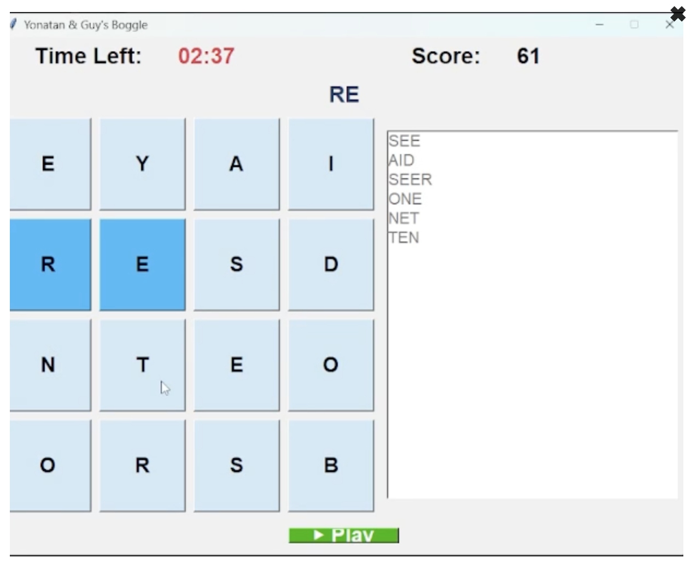
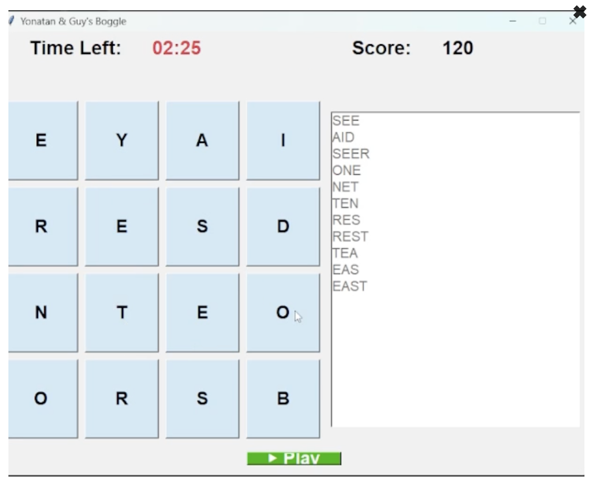

# Boggle Game

An interactive game featuring a character exploring an environmental area.  
The game world includes trees, leaves, and fruits that interact dynamically with the avatar.

  
  

## 🎮 How to Play

Before running the game, you need to add the **DanoGameLab** dependency:  
**File → Project Structure → Modules → Dependencies → DanoGameLab.jar**

Once added, run the main class to start the game.  
Use the avatar to explore, jump, and interact with the environment.

